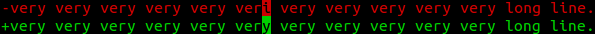

<!--
This explains this project targeting politicians.

It does not contain any information not present elsewhere in this project:
only an optimized version for the target audience.
-->

# Text development with Version control

Definition: *text* can be either: textbook, tutorial, paper, legal document, ...

## Summary

1. **every single** software project uses version control.
1. **text is similar to computer code**: a bunch of characters put together
1. **there is no good enough tool** for version control for text
1. it is **easy** to adapt existing version control tool to text
1. it is **hard** to convince authors to use new tools, even if better

Conclusion: huge **efficiency gains** are behind a **small technological barrier**,
and a **big behavioral barrier**.

## Goals and rationale

Increase the **quality / cost ratio** of text.

Usage cost can be **reduced to 0** for **huge projects**, created by thousands
and used by millions: Firefox, LibreOffice, Linux, Apache, jQuery, GNU, ...

The same can happen for text.

Why people contribute for free:

1. to **become famous** and get better jobs
1. they use the project and want to **improve it for their clients**

## Why text instead of video

Many MOOCs and websites like Kahn Academy, give emphasis to videos.

However, videos have **larger associated costs** than text to
create, modify, search inside, transmit and store.

For example, adding a phrase to a text can be done in minutes with a simple
text editor, while adding a phrase to a video would require recreating the filming set
and more complex tools.

This project does not aim to do everything MOOCs do: it could be used by MOOCs
to produce better textual resources.

## Advantages of version control

The following features are already implemented in existing open source version control systems:

-   return to an older version if an error was made.

-   view the differences between two versions:

    - before you create a new version: did I alter anything I shouldn't have?
    - when someone makes a suggestion, you can see exactly what he is modifying

    The difference looks like this:

    

    where the minus sign `-` is for the old line, and the plus sign `+` is for the new one.

-   refer to an specific version.

    If you say: "look at Section 1", the section might not be there anymore tomorrow.

    With versions, you can say: "look at Section 1, version 2.0"

-   upload your project online in one click so that others can see it and to backup them.

    Efficient because only new versions are uploaded.

    Allows you to work offline on your own computer with your preferred text editor.

-   work on multiple features at once.

    E.g.: you are writing a new chapter when someone reports an error on existing ones.

    You can:

    - save the current chapter as it is
    - go back in history before you started the chapter
    - fix the error in a new version
    - get back to the new chapter and finish it
    - create a new version that incorporates both the new chapter and the correction

    After you to that, the version tree will look like:

        |
        o   Start the book.
        |\
        | o Fix error.
        | |
        o | New chapter.
        | |
        |/
        o   Fix error and new chapter.
        |

    Note how the tree *branched out* and then came back together.

-   allow to modify projects on a browser without installing the version control software

-   provide a system to submit and evaluate suggestions called *merge requests*

-   make the code browsable online

-   offer a specialized forum system to treat errors called a *bug tracker*

## Missing features

Existing version control systems were created for developing general code, not text.

This projects aims to **specialize and adapt** version control systems to text development
via the following features:

-   when users save the text while editing on the browser,
    the system generates **HTML, PDF, EPUB outputs**.

-   a browser editor with **side by side source / preview** view for individual files,
    compatible with the generated outputs.

-   allow **everything** to be done on the browser.

    Current systems only allow certain operations: others must be done locally.

    This represents a large entry barrier for non programmers.

-   writers can **set a price** for the generated output, readers **pay** to have it.

-   **quality measures for everything**: users, projects, comments, etc.

    Help people find the best material, and give the best contributors due credit.

## Learn more

See <https://github.com/booktree/booktree> for:

1. existing alternatives
1. sustainable business model
1. implementation plan
